# C++ Key-Value Store

## Overview

This project is a networked, multi-threaded key-value (KV) data store built in C++. It features a client-server architecture that communicates over TCP/IP, allowing multiple clients to concurrently connect and perform Create, Read, Update, and Delete (CRUD) operations. The server is designed for concurrency and data persistence, making it a foundational project for understanding distributed systems and cloud-edge software services.

This project was developed to demonstrate core software engineering principles, including concurrent programming, network communication, and modular design, directly aligning with the skills required for developing robust and scalable software solutions.

## Features

*   **Client-Server Model**: A dedicated server application handles data storage logic, while a separate command-line client interacts with it over the network.
*   **CRUD Functionality**: Supports the fundamental database operations:
    *   `put <key> <value>`: Adds or updates a key-value pair.
    *   `get <key>`: Retrieves the value associated with a key.
    *   `delete <key>`: Removes a key-value pair.
*   **Multi-threaded Server**: The server uses `std::thread` to spawn a new thread for each connected client, enabling it to handle multiple simultaneous connections efficiently.
*   **Thread-Safe Data Access**: Concurrent read/write operations are managed using `std::shared_mutex` to prevent data races. This allows multiple clients to read data simultaneously (`get`) while ensuring exclusive access for write operations (`put`, `delete`), optimizing performance.
*   **Data Persistence**: The key-value store automatically saves its state to a local file (`kvstore.db`) after any modification, ensuring data is retained across server restarts.

## Technology Stack

*   **Language**: C++ (C++17)
*   **Networking**: Winsock2 API (Windows) / Sockets (`-pthread` for Linux/macOS)
*   **Concurrency**: C++ Standard Library (`<thread>`, `<shared_mutex>`)
*   **Build System**: `make`
*   **Data Structures**: `std::unordered_map` for efficient O(1) average time complexity on key lookups.
*   **File I/O**: C++ Standard Library (`<fstream>`) for data persistence.

## Project Structure

The project follows a clean, modular structure that separates concerns and improves maintainability.

```
.
├── .gitignore         # Specifies intentionally untracked files to ignore
├── Makefile           # Automates the build process for the server and client
├── Readme.md          # Project documentation
└── src/               # Contains all C++ source code
    ├── client.cpp     # Entry point and logic for the client application
    ├── kvstore.cpp    # Implementation of the core KVStore class
    ├── kvstore.h      # Header file for the KVStore class
    └── server.cpp     # Entry point and logic for the server application
```

## How to Build and Run

This project uses a `Makefile` for easy compilation on both Windows and Unix-like systems (Linux, macOS). The final executables will be placed in a `build/` directory.

### Prerequisites

*   A C++ compiler that supports C++17 or later (e.g., g++).
*   The `make` build automation tool. On Windows, this is commonly available through environments like **MinGW-w64** or **MSYS2**.

### Build Instructions

Open a terminal or command prompt in the root directory of the project and use the following commands:

1.  **To build both the server and client:**
    ```bash
    make
    ```
    Alternatively, you can use `make all`.

2.  **To remove all compiled files and the `build/` directory:**
    ```bash
    make clean
    ```

### Execution

1.  **Start the Server**: Run the server executable from the `build` directory. It will load data from `kvstore.db` (if it exists) and start listening on port 9000.
    ```bash
    # On Windows
    ./build/server.exe

    # On Linux/macOS
    ./build/server
    ```
    You should see the output: `Server running on port 9000...`

2.  **Start the Client**: Open one or more new terminal windows and run the client executable.
    ```bash
    # On Windows
    ./build/client.exe

    # On Linux/macOS
    ./build/client
    ```
    The client will connect to the server, and you can start sending commands.

## Architecture

```mermaid
graph TD
    subgraph Clients
        Client1["🖥️ Client 1"]
        Client2["🖥️ Client 2"]
        Client3["🖥️ Client 3"]
    end

    subgraph Server["🧠 Multi-threaded TCP Server"]
        TCPServer["🔌 TCP Listener"]
        Thread1["🧵 Thread 1"]
        Thread2["🧵 Thread 2"]
        Thread3["🧵 Thread N"]

        TCPServer --> Thread1
        TCPServer --> Thread2
        TCPServer --> Thread3

        subgraph KVStore["📦 Singleton KVStore"]
            Mutex["🔒 std::shared_mutex"]
            Data["📚 std::unordered_map"]
            Persistence["💾 kvstore.db"]
        end

        Thread1 -->|put/get/delete| Mutex
        Thread2 -->|put/get/delete| Mutex
        Thread3 -->|put/get/delete| Mutex

        Mutex <--> Data
        Mutex <--> Persistence
    end

    Client1 -->|put name john| TCPServer
    Client2 -->|get name| TCPServer
    Client3 -->|delete name| TCPServer
```



## How to Use

The client provides a simple command-line interface. Enter commands in the format `<command> <key> [value]`.

*   **Add/Update a value:**
    ```
    Enter the command: put name john
    Server: SUCCESS: Added 'john' with key 'name'
    ```

*   **Retrieve a value:**
    ```
    Enter the command: get name
    Server: SUCCESS: name = john
    ```

*   **Delete a value:**
    ```
    Enter the command: delete name
    Server: SUCCESS: Removed 'name'
    ```

*   **Attempt to get a non-existent key:**
    ```
    Enter the command: get name
    Server: ERROR:KEY_NOT_FOUND 'name'
    ```

*   **Exit the client:**
    ```
    Enter the command: exit
    ```